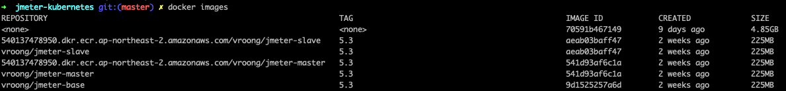

# jmeter-kubernetes

## Reference
- 이 Repository 를 참고했음. [Link](https://github.com/kubernauts/jmeter-kubernetes).

## 준비

### Docker image build
#### Base image
```shell script
$ cd {프로젝트 디렉토리}/docker/jmeter-base
$ docker build vroong/jmeter-base:5.3 .
```
#### Master
```shell script
$ cd {프로젝트 디렉토리}/docker/jmeter-master
$ docker build vroong/jmeter-master:5.3 .
```
#### Slaves
```shell script
$ cd {프로젝트 디렉토리}/docker/jmeter-slave
$ docker build vroong/jmeter-slave:5.3 .
```

### Kubernetes 클러스터에 배포하기 위해 AWS ECR 에 배포

#### Docker image 확인
```shell script
$ docker images
```


#### Tagging
- tag 대상 이미지 id 를 사용
- ECR full 경로를 사용하고 버전을 `:` 뒤에 붙여준다.
```shell script
docker tag 541d93af6c1a 540137478950.dkr.ecr.ap-northeast-2.amazonaws.com/vroong/jmeter-master:5.3
docker tag aeab03baff47 540137478950.dkr.ecr.ap-northeast-2.amazonaws.com/vroong/jmeter-slave:5.3
```

#### Token 획득
- 이 작업을 할 때 반드시 `$HOME/.aws` 디렉토리에 push 하기 위한 계정의 credential 이 있어야 한다.
```shell script
aws ecr get-login-password --region ap-northeast-2 | docker login --username AWS --password-stdin 540137478950.dkr.ecr.ap-northeast-2.amazonaws.com
```

#### ECR 에 push
```shell script
docker push 540137478950.dkr.ecr.ap-northeast-2.amazonaws.com/vroong/jmeter-master:5.3
docker push 540137478950.dkr.ecr.ap-northeast-2.amazonaws.com/vroong/jmeter-slave:5.3
```

### kubernetes 에 배포
- 변경하고 싶으면 `jmeter_*.yaml` 을 수정한다.
- kubectl 을 사용해서 context 를 선택하고 `namespace` 에 배포할 namespace 를 기록해 준 뒤 아래 파일을 실행
```shell script
$ ./jmeter_cluster_create.sh
```

## 실행
- 아래 script 들은 스크립트가 있는 경로에서 실행하는것을 가정하고 있다.

### CSV(TSV) 파일을 server 들에 배포하고 실행할 경우 아래와 같이 실행
```shell script
$ ./start_test_csv.sh {TSV 를 포함한 디렉토리} {실행 파일명}
```
```shell script
$ ./start_test_csv.sh tests stress-branch-regions-20200918.jmx
```

### jmx 로만 실행할 경우 아래와 같이 실행
```shell script
$ ./start_test.sh {실행 파일명}
```
```shell script
$ ./start_test.sh stress-branch-regions-20200918.jmx
```

## 중지
- 아래 스크립트를 사용해서 중지하지 않으면 다시 테스트를 시작할 수 없다.
```shell script
$ ./jmeter_stop.sh
```

## 결과
- 마스터 노드에 생성된 결과 파일을 로컬로 가져와서 jmeter ui 에서 확인한다.

### 결과파일 위치
- 마스터 노드의 `/tmp/results.csv` 라는 파일로 존재함

### 결과파일 로컬로 복사
```shell script
$ master_pod=$(kubectl get po -n "${namespace}" | grep jmeter-master | awk '{print $1}')
$ working_dir=$(pwd)

$ kubectl cp -n vroong-dev1 "${master_pod}:/tmp/results.csv" "${working_dir}/tmp/results.csv"
```

### 확인
- jmeter ui 에서 add -> listener 에서 확인하고 싶은 결과 타입을 추가한다.
- add -> listener -> Response Time Graph 추천
